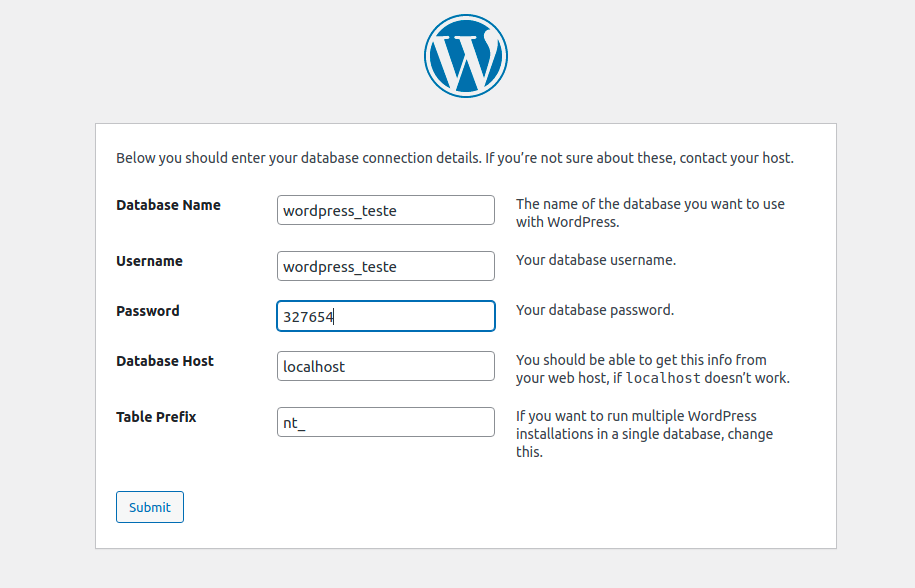
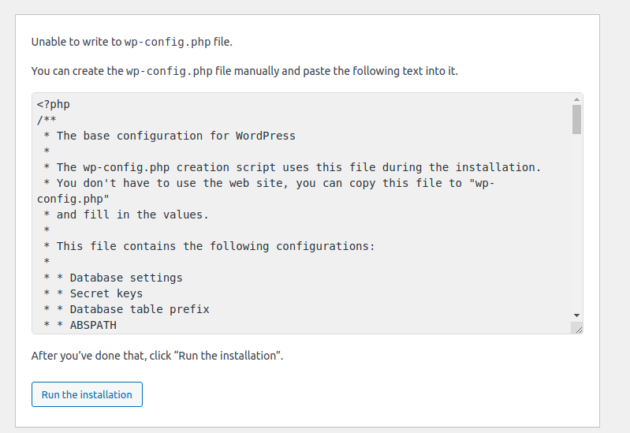

# Introdução

Este é um template feito para testes e seguindo a ideia proposta em [Navas-Figma](https://www.figma.com/file/8yPNAVRLSa5eE1gclfelA2/Blog---Teste-Navas?node-id=0%3A1).

Aqui você vai encontrar o básico para instalação Wordpress (localhost) e implementação do tema utilizando OS Linux, distro baseada em Debian.

Caso você esteja usando algum desktop diferente, como Windows ou Mac, recomendo que utilize outros tutoriais para ajudar na instalação inicial.

# Prepare o Desktop

O que você vai precisar:

1. Arquivos [Wordpress](https://wordpress.org/download/releases/);
2. Instalar [Apache2](https://archive.apache.org/dist/httpd/binaries/);
3. Instalar MariaDB [Server](https://mariadb.org/mariadb/all-releases/) e [Client](https://mariadb.com/kb/en/mariadb-connector-j-11-release-notes/);
4. Instalar MySQL;
5. Instalar pacotes [PHP](https://github.com/php/php-src);

Você pode fazer o download normalmente nos links de referência, como também instalando pacotes diretamente no terminal. 

Atualize seu repositório Linux antes de começar a instalar.

```bash
sudo apt update
```


## Arquivos Wordpress

```bash
wget https://wordpress.org/wordpress-5.9.zip
```

> O tema foi desenvolvido utilizando a versão 5.9 do Wordpress.

Existem duas maneiras de instalar os arquivos Wordpress: diretamente no diretório do Apache2 ou criando um link simbólico na pasta do Apache2. Ambas as maneiras servem, porém neste tutorial o processo será feito a partir do link simbólico. Portanto, escolha qualquer lugar que desejar para instalar seu wordpress.


## Apache2

```bash
sudo apt install apache2 -y
```

Logo após a instação você pode verificar se o Apache2 está ativo em seu localhost. Abra o navegador e digite localhost na caixa de texto de url.

Caso o Apache2 não esteja ativo, o documento HTML não será exibido no localhost. Você pode tentar iniciar o apache2 com o seguinte comando:

```bash
sudo systemctl start apache2
```


## MariaDB

```bash
sudo apt install mariadb-server mariadb-client -y
```

Inicie MariaDB com o seguinte comando:

```bash
sudo systemctl start mariadb
```

Para verificar o status do programa use:

```bash
sudo systemctl status mariadb
```


## MySQL

Para configurar MySQL e funcionar junto com seu servidor, escreva o seguinte comando em seu terminal:

```bash
sudo mysql_secure_installation
```

Algumas opções de configuração vão surgir no terminal para definir uma confirmação padrão, baseada em suas escolhas.

- *Enter current password for root (enter for node):* 

Se você nunca instalou um servidor anteriormente, não haverá senha do root, apenas pressione enter para continuar.

- *Set root password? [Y/n] Y*

Digite 'Y' pra configurar uma senha para o root.

- *Remove anonymous user? [Y/n] Y*
- *Disallow root login remotely? [Y/n] Y*
- *Remove test database and acces to it? [Y/n] Y*

Digite 'Y' para prevenir que usuários anônimos se conectem a sua base de dados, que não haja acesso remoto e para remover sua database de teste. É uma medida de segurança, se desejar utilizar o servidor ainda como teste, apenas digite 'n'.

- *Reload privilege tables now? [Y/n] Y*

Digite 'Y' para atualizar suas mudanças na base de dados.


## PHP

```bash
sudo apt install php php-mysql php-cgi php-cli php-gd  -y
```

# Configuração

Caso você ainda não tenha extraído o **.zip**,  crie uma pasta com o nome que desejar e um subfolder **com o nome a seguir**:

```bash
mkdir minha_pasta_wordpress && cd minha_pasta_wordpress
mkdir navas-test && cd navas-test
unzip -q wordpress*.zip -d minha_pasta_wordpress/navas-test
```

Depois crie o link simbólico com o nome **work** na pasta de repositórios do Apache2:

```bash
cd /var/www/html
sudo ln -s minha_pasta_wordpress work
```

Reinicie o Apache2 e mude a propriedade de usuário na pasta de repositórios do Apache2:

```bash
sudo systemctl restart apache2
sudo chown -R www-data:www-data /var/www/*
```

Se desejar, você pode utilizar o banco de dados de teste, com usário de teste e posts de exemplo postados. O arquivo se encontra na pasta **bd** do tema inserido.

> Antes de importar um database e/ou de continuar com a configuração do Wordpress, crie primeiramente um database e um usuário. Garanta que este usuário tenha todos os privilégios no database, senão a criação do wordpress não poderá ser concluída.

```mysql
-- use este comando no terminal para acessar seu database:
-- sudo mysql -u root -p
CREATE DATABASE database_name;
USE database_name;
CREATE USER "wordpress_teste"@"%" identified by "password";
GRANT ALL PRIVILEGES ON database_name.* TO "wordpress_teste"@"%";
```

# Inserindo o Tema


Agora você pode baixar o tema na pasta de temas do Wordpress. Vá até a pasta *work/navas-test*, baixe o projeto e altere o nome original do novo arquivo para **navas-template**:

```bash
cd work/navas-test/wp-content/themes
git clone https://github.com/Ravenbells/simple-blog-template-wordpress.git
mv simple-blog-template-wordpress navas-template
```

O comando abaixo importa todas as tabelas do tema para o seu database.

```bash
sudo mysql -u root -p database_name < work/navas-test/wp-content/themes/navas-template/bd/navas_template*.sql
```

> Usuário Wordpress:
>
> - Teste
>
> Senha Wordpress:
>
> - admin_navas
>
> Prefixo das tabelas:
>
> - nt_

Termine a configuração do database no seu localhost. Você pode acessar usando *localhost/work/navas-test* ou com o *IP/work/navas-test*. Para acessar com o IP da sua máquina, use o endereço seguido de **inet** que é exibido no terminal com o comando **ifconfig**:

```bash
ifconfig
enp0s31f6: flags=4163<UP,BROADCAST,RUNNING,MULTICAST>  mtu 1500
        inet 192.168.0.15  netmask 255.255.255.0  broadcast 192.168.0.255
```

A imagem a seguir só mostra um exemplo de como você irá definir as configurações. O nome de seu database, nome de usuário e senha ficam a seu critério. Você deve **manter obrigatoriamente** o host (localhost) e o prefixo da tabela (nt_).



O Wordpress irá informar que é impossível escrever em **wp-config.php**. Copie todo o código que está na caixa cinza e crie o arquivo manualmente no diretório do Wordpress. O arquivo **wp-config.php** deve ficar no diretório principal (raíz/root) da pasta.



Você pode criar o arquivo com o seguinte comando:

```bash
touch wp-config.php
```

Quando terminar a configuração do Wordpress, adicione as seguintes linhas em **wp-config.php**, no final do documento:

```php
define('FS_METHOD','direct');
define(	'UPLOADS', 'wp-content/uploads'	);
```

A primeira linha lhe permitirá acesso direto a sua database, e portanto, poderá trocar configurações de segurança e instalar plugins. A segunda linha irá definir a pasta de uploads para guardar arquivos provenientes da galeria.

Se notar que ainda há erros de alterações de segurança ou de uploads de imagem, use novamente o comando abaixo no **caminho orignal** da pasta **work**. Sem ser no caminho do link simbólico:

```bash
sudo chown -R www-data:www-data work/*
```
